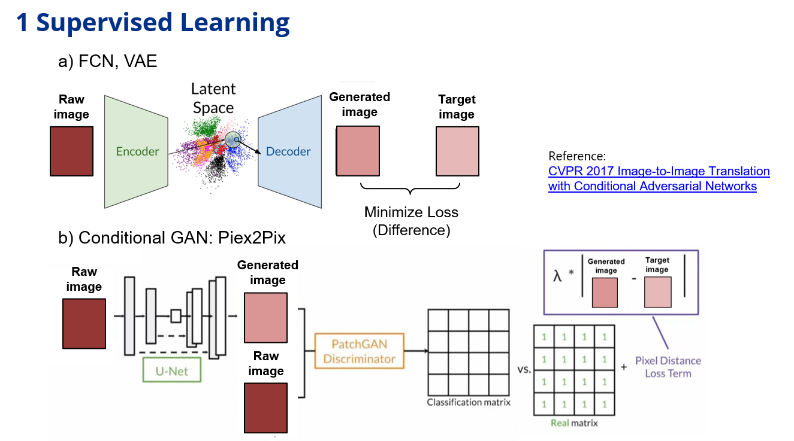
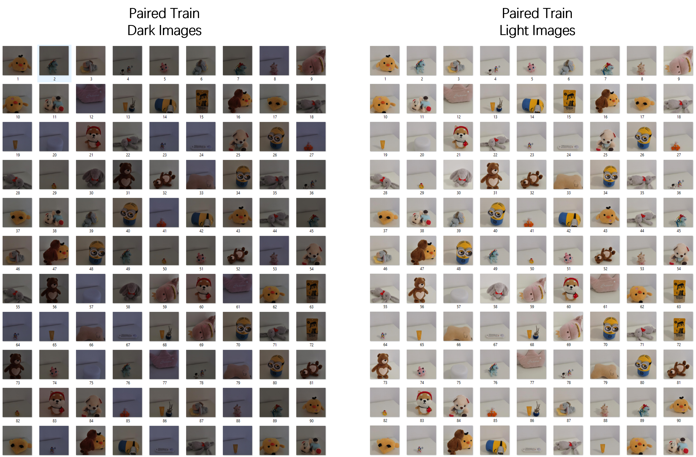
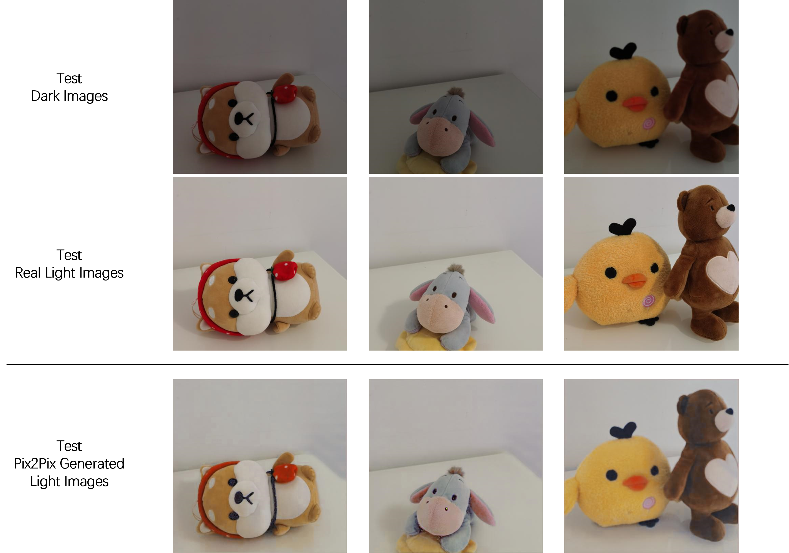

# dark-image-enhancement-Pix2Pix
This objective is to switch light conditions / enhance color for dark images. In general, there are three types of machine learning techniques which can be used to enhance image color: 1. supervised learning models based on paired dark/light images; 2. unsupervised learning style transfer models based on one stack of dark images and the other stack of light images; 3. reinforcement learning to learn steps to adjust brightness, sharpness, or contrast. 

This project implements the Pix2Pix model, which uses [U-Net](https://arxiv.org/abs/1505.04597) as the image generator to produce estimated light images. Structured like the contracting path of the U-Net, the PatchGAN discriminator tells how much the estimated images are close to the real light images. Generator loss consists of adversarial loss and reconstruction loss while discriminator loss includes the difference between contracted real images and ones-arrary, and the difference between conratcted generated fake images and zeros-array.

Mandatory python packages:
- torch (cpu/cuda)
- torchvision
- PIL
- matplotlib

  

## Training Images

  

## Testing Images

  

